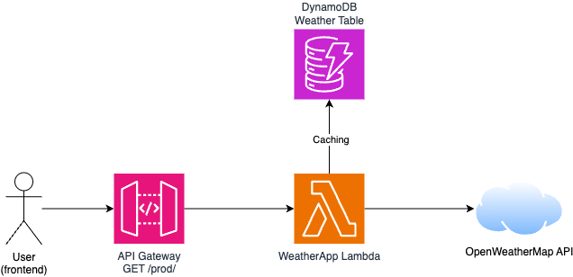

# NL Lab - Weather App

Some personal project to test and learn CDK, Typescript & React

## **Demo available here :** https://weather.lab.lakebir.fr/

## Application purpose 

* Create a script using Typescript, retrieving weather information from OpenWeatherMap
* Data is cached in DynamoDB for a specific time (by default : 1 hour)
* Script is uploaded to AWS Lambda
* Lambda function can be called through API Gateway
* Use of AWS CDK to create all this stack
* Deploy a React-backed frontend (developed with Next.js) to call API and display weather information

## Application architecture 

## Folder explanation

* `./bin` and `./lib` : CDK stacks and constructs
* `./lambda` : Lambda script for backend service
* `./frontend` : ... frontend ! Yay, what a surprise.

## How to run ?

A `deploy.sh` script is available to automagically deploy the app to your AWS account (assuming you are already authenticated to AWS).

Please ensure you can run :
* npm
* tsc
* cdk
* jq

**IMPORTANT** : Copy the `.env.sample` file to a `.env` file with your own `OpenWeatherMap` API Key

`deploy.sh` script will :
* install all needed NPM dependencies
* compile typescript lambda
* bootstrap and deploy CDK stack
* build frontend

React client will be available under `frontend/out` directory. You can either upload it to your prefered platform, or run `local.sh` script, that will open it locally for you !

## Note on dev run

If you want to run the react app in local debug mode *(ie. with `npm run dev` command)*, you will need to provide the backend URL using `NEXT_PUBLIC_API_URL` environment variable.

To obtain backend URL, you first have to deploy the CDK Stack. An `ApiURL` output will appear on your console when stack is deployed.

## How to improve ?

* 🧪 Tests, tests and tests 
* 🇪🇺 i18n 
* 🔎 Add a combobox / searchbox to search for other cities

## Thanks for reading !

**Have a nice hacking day !**